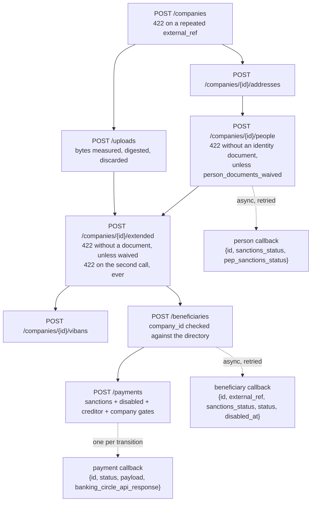

# Architecture: B4B Oversight — the boarding half

## Goal

`docs/ARCHITECTURE-vendor-corrections.md` §4 built the payout half of the
B4B mock: beneficiaries, the payment lifecycle, the callbacks, the Banking
Circle bridge. It deliberately left boarding out — "buddy's real
registration flow is out of scope" (Addendum §F).

That gap turned out to be where the integration actually breaks. A client
could reach `POST /payments` here without ever proving it could board a
merchant, so every boarding rule went unexercised: the profile that can be
created only once, the identity document that is only waivable in some
countries, the duplicate reference that means "you already sent this". A
client got a green run against this lab and a 422 in production.

This document is the design record for the boarding half. Together the two
make `b4b` a rail a platform can be built against end to end: board a
merchant, register its payee, pay it.

## What is simulated, and what is deliberately not

The line is between **the contract** and **the judgement**.

| Simulated, because a client gets it wrong | Not simulated, because this lab has no standing to judge |
| --- | --- |
| Required fields, and which ones the waiver flags switch off | Whether a person is really who they say they are |
| Create-once on the extended profile | Whether a company should be onboarded |
| Duplicate `external_ref` → 422 | Real sanctions, PEP and KYB screening |
| The two-step upload → reference flow | Whether a document is genuine, or even a document |
| Screening reported asynchronously, on a callback, twice (sanctions and PEP separately) | Adverse media, ownership graphs, risk scoring |
| A payee that screens clean and is still disabled | |

Everything boarded **passes**. Every document uploaded is **accepted**, and
its bytes are **discarded** — this lab has no business holding identity
documents, invented or otherwise. Statuses move only when something asks
them to, through the lab-only `PUT /sim/...` endpoints, exactly as the
beneficiary sanctions gate already worked.

That is the deliberate shape: **the shapes and rules are real, the verdicts
are not.** A mock that invented a rejection reason would be teaching a
client to handle a case that does not exist; a mock that had no rejections
at all would be teaching it there are none.

The seam for later: every screening decision is set in one place at create
time (`Directory.CreateCompany`, `AddPerson`, `BeneficiaryStore.Register`,
all defaulting to `pass`). A rules file — "fail when the legal name matches
this, review when the country is that" — drops in there without touching a
handler.

## The chain

## The four refusals worth having

Each of these is a real 422 a client meets in production and cannot meet
against a mock that only answers the happy path. `b4b-company-boarding` in
the harness asserts all four.

**1. A repeated `external_ref` is 422, not a second company.** This is the
signal a reconciler reads as "I already sent this". Creating a second
company under the same reference would make that signal unavailable and
leave two companies nobody can choose between.

**2. An identity document is required on a natural person** —
`document_type`, `document_number`, `document_country` — unless the company
was created with `person_documents_waived`. This is the difference between
a GB boarding that works and a non-GB one that does not, and it is why a
client that only ever boarded GB merchants has a data-capture gap it does
not know about. (In the real API the waiver is granted per client account,
so a client relying on it everywhere is building on something it may not
have been given.)

**3. The extended profile can be created once, ever.** There is no update
endpoint in the real API and there is none here. A boarding chain that runs
company → addresses → people → extended → beneficiaries and is re-run after
the last step fails will re-post this. A client that treats the resulting
422 as a hard error sticks on this step forever. The refusal names the
profile that already exists, and `GET /companies/{id}/extended` is the read
that makes the retry correct.

**4. A profile naming an upload that never happened is refused.** The
two-step upload flow only means anything if the second step checks the
first happened.

## Deliberate decisions

### Bodies are read leniently

Boarding endpoints use `httputilx.ReadJSONExtras`, not `ReadJSON`. Fields
this mock has no column for are **kept and echoed back** under `extra`,
not refused.

`ReadJSON`'s `DisallowUnknownFields` is the right default when the schema is
known: a caller that misspells a field is told immediately instead of
watching it vanish. It is the wrong default for a mock of a third-party API
whose full schema is not published to us. Answering 400 to a field the real
vendor accepts teaches a client to *remove* it — a worse outcome than not
modelling it. So: decode what we model, keep what we do not, drop nothing.

The payout endpoints changed to match, for the same reason.

### `external_ref` is a lookup key on a company, and is not one on a person

Because that is how the real API behaves. `external_ref` on a person is
documented as not saved, and the person callback carries no `external_ref`
and no entity type — only the id. A client that attached its own reference
to a person, or that keeps natural persons and shareholding companies in
two tables with two id sequences, **cannot correlate that callback**. That
is not an omission in this mock; it is the constraint. The only correct
answer is to persist the id the create returned and resolve on that, and
this mock is where a client should discover it. Sending an `external_ref` on
a person is logged, once, saying exactly that.

### Everything is persisted

`B4B_STATE_PATH` (default `/b4b-data/state.json`), whole-file,
write-then-rename, the same shape the console's registry uses.

In-memory was defensible while a payment lived for two seconds. Boarding is
not like that: a company, its people and its profile are the result of a
chain a client walked once. Worse, a forgotten extended profile silently
*un*-breaks a client that should have been told it already sent one — the
mock would stop reproducing the bug precisely because it restarted.

Payments persist too, and a payment caught mid-lifecycle by a restart
**resumes from where it stopped** rather than replaying states the client
was already told about. Left alone it would look to a client exactly like a
webhook that never arrived, and it would wait for one forever.

### Callbacks go to a client-account endpoint

`B4B_CALLBACK_URL` is where a callback goes when the record it is about
carries no `callback_url` of its own. The real API has exactly this — one
endpoint agreed per client — and no per-record field. Without it, boarding
callbacks had nowhere to go: they were computed and dropped, and a client
waited forever for a screening result it was never going to be sent.

The per-record `callback_url` stays as a lab affordance (it is how
`settlement` and the harness work today), and it wins where present. Every
callback now goes through one retrying path — the real vendor retries these
for about a day, and a subscriber that answers 500 once should not lose a
screening result permanently.

### Two checks that exist because the answer is unknown

**`chargeBearer` is `SHA | BEN | OUR`**, the ISO 20022 values the vendor
documents — not `DEBT | CRED`, which appear in at least one client's own
type and in no specification. A mock that accepted those would confirm a
mistake rather than catch it.

**`B4B_ENFORCE_BENEFICIARY_COMPANY`** refuses a payment whose `company_id`
is not the one its beneficiary was registered under. It is **off by
default**, because whether the real API enforces this is not known to this
lab — and it decides whether a platform that registers payees under its
merchants' companies and pays them as itself works at all, or is refused on
every single payout. With it off, the mismatch is logged every time, so the
question stays visible. Turn it on to find out what your client does when
the answer is "refused".

### What is knowingly *more* forgiving than the real API

`GET /beneficiaries/{id}` still auto-vivifies for an unknown id and never
answers 404 (Addendum §F). A wrong id therefore reads back as a plausible
payee here and as nothing at all in production. It stays because this lab's
own `settlement` stand-in and its demos depend on it — but it is the one
place a green run here does not mean a green run there.

## Endpoints

| Method | Path | Notes |
| --- | --- | --- |
| `POST` | `/oversight/v1/companies` | 422 on a repeated `external_ref`; registered office inline |
| `GET` | `/oversight/v1/companies` | lab convenience |
| `GET` | `/oversight/v1/companies/{id}` | resolves by id *or* `external_ref` |
| `POST` `GET` | `/oversight/v1/companies/{id}/addresses` | |
| `POST` `GET` | `/oversight/v1/companies/{id}/people` | natural persons and legal entities |
| `GET` | `/oversight/v1/companies/{id}/people/{personID}` | |
| `POST` | `/oversight/v1/companies/{id}/extended` | create-once |
| `GET` | `/oversight/v1/companies/{id}/extended[/{extendedID}]` | the pre-check before a retry |
| `POST` `GET` | `/oversight/v1/companies/{id}/vibans` | stable per currency |
| `POST` | `/oversight/v1/uploads` | multipart, raw body, or JSON metadata |
| `GET` | `/oversight/v1/uploads/{id}` | the receipt; there is no file |
| `POST` `GET` | `/oversight/v1/beneficiaries[/{id}]` | now takes `company_id` |
| `POST` `GET` | `/oversight/v1/payments[/{id}]` | |
| `PUT` | `/sim/companies/{id}/sanctions` | lab-only |
| `PUT` | `/sim/people/{id}/sanctions` | lab-only; the two statuses move independently |
| `PUT` | `/sim/beneficiaries/{id}/sanctions` | lab-only |
| `PUT` | `/sim/beneficiaries/{id}/status` | lab-only; active/disabled |

## New env vars

| Var | Default | What it does |
| --- | --- | --- |
| `B4B_STATE_PATH` | `/b4b-data/state.json` | everything b4b remembers; empty disables persistence |
| `B4B_CALLBACK_URL` | *(empty)* | the client-account callback endpoint |
| `B4B_JWT_PUBLIC_KEY_PATH` | *(empty)* | verify inbound tokens against a *client's* public key, which is how a real vendor holds the credential; empty keeps the lab's generate-our-own-keypair behaviour |
| `B4B_ENFORCE_BENEFICIARY_COMPANY` | `false` | refuse a payment from a company other than the payee's |

## Where the wire shapes came from, and what to confirm

The payout half was derived from a real client's source
(`ARCHITECTURE-vendor-corrections.md` §4). The boarding half was derived
from two independent readings of the vendor's published documentation, and
those readings **disagree in places**. Where they disagreed this mock takes
the superset and says so, rather than picking one silently:

- **The beneficiary callback body.** One reading has `{external_ref,
  sanctions_status}`; the other adds `id`, `status` and `disabled_at`. This
  mock sends all five. If the shorter reading is right, a client cannot
  correlate on `id` and must use `external_ref`.
- **`nace_codes`.** The guide calls it required; the schema does not mark it
  so. Not enforced here, and logged when absent.
- **`registered_company_no` vs `company_number`.** Both names appear in the
  vendor's own material. This mock uses `registered_company_no`.
- **Same-company beneficiary ownership.** See
  `B4B_ENFORCE_BENEFICIARY_COMPANY` above.
- **Whether the real API refuses unknown fields.** Assumed not; see
  "Bodies are read leniently".

Each is a one-line question to the vendor, and each changes what a correct
client does. They are listed here so the disagreement stays visible rather
than being settled by whoever edited the mock last.

## See also

- `ARCHITECTURE-vendor-corrections.md` §4 + Addendum §A/D/F — the payout half
- `structure/b4b.md` — file by file
- `principles.md` — the sim/prod line, and the no-vendor-secrets rule this
  document is written to stay inside: shapes and field names, never a
  vendor's own request/response bodies, never a credential
