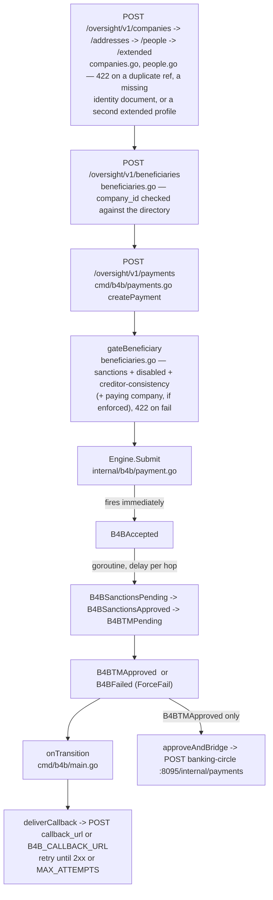
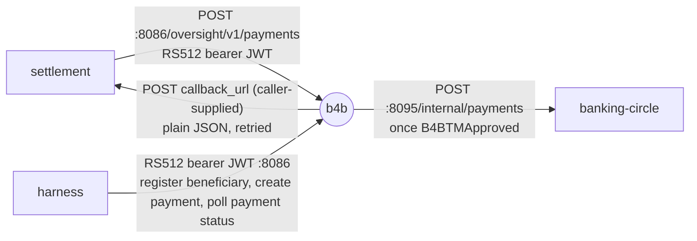

# b4b — file by file

The payout rail, in two halves. **Boarding**: companies, addresses, people,
extended profiles, document uploads and vIBANs — the chain a platform walks
before it can pay anybody. **Payout**: beneficiaries and their
sanctions/creditor/disabled gates, the
`B4BAccepted`→…→`B4BTMApproved`/`B4BFailed` lifecycle, a callback on every
phase change, and the bridge into banking-circle once approved. All of it
RS512-JWT-authed, and all of it persisted.

See [structure overview](README.md) for the general cmd/+internal pattern
this follows, and
[ARCHITECTURE-b4b-oversight.md](../ARCHITECTURE-b4b-oversight.md) for why
the boarding half refuses what it refuses.

## Packaging

`docker/Dockerfile.b4b` builds `./cmd/b4b` only. `compose.yml`'s `b4b:`
service exposes one port, `:8086`, **plain HTTP — no TLS at all**: unlike
banking-circle, this lab's B4B auth is entirely an inbound RS512-signed
bearer JWT that `cmd/b4b` itself verifies, not a transport-level
credential. `B4B_JWT_KEYS_DIR=/b4b-keys` is a read-write volume b4b
generates its RSA-2048 keypair into on first start; `settlement` mounts the
same directory read-only to sign its outbound calls with the matching
private key. (`B4B_JWT_PUBLIC_KEY_PATH` inverts that to the real-vendor
arrangement — b4b holds only a *client's* public key — for a third-party
client that owns its own signing key.) `BANKING_CIRCLE_URL=http://banking-circle:8095`
points at banking-circle's plain-HTTP internal bridge, not its mTLS surface.

`B4B_STATE_PATH=/b4b-data/state.json` is a second read-write volume, and
it is not optional to the point of the service: boarding is a chain a
client walks once, so a restart that forgot it would mean re-boarding
before every run — and a forgotten create-once extended profile would
silently stop reproducing the bug it exists to reproduce. `make up`
creates `b4b-data/` world-writable, the same tradeoff as `console-data/`.

## `cmd/b4b/` — the binary (`package main`)

| File | Responsibility |
| --- | --- |
| `main.go` | env/flags; `loadVerificationKey` (a client's public key, or the lab's own generated pair); wires `b4b.Engine` + `b4b.BeneficiaryStore` + `b4b.Directory` + allowlist; restores the state file and installs `persist` as every store's `OnChange`; routes; `requireAuth` middleware; `writeStoreError` (the 400-vs-422 mapping); `deliverCallback`/`postWebhook` — the one retrying delivery path every callback goes through |
| `companies.go` | `createCompany` (422 on a repeated `external_ref`), `listCompanies`/`getCompany`, `createAddress`/`listAddresses`, `createExtended` (422 on the second, ever) / `getExtended`, `createViban`/`listVibans`, lab-only `setCompanySanctions` |
| `people.go` | `createPerson` (natural persons and legal entities, same endpoint), `listPeople`/`getPerson`, lab-only `setPersonSanctions`, `deliverPersonCallback` — `{id, sanctions_status, pep_sanctions_status}` and deliberately nothing else |
| `documents.go` | `uploadDocument` — multipart, raw body or JSON metadata; the bytes are measured, digested and **discarded** — and `getDocument`, which returns the receipt because there is no file |
| `payments.go` | the Oversight wire types; `createPayment`/`getPayment`; `onTransition` → `approveAndBridge` (banking-circle bridge) + `deliverPaymentCallback` |
| `beneficiaries.go` | `registerBeneficiary` (now takes `company_id`, checked against the directory) / `getBeneficiary` (auto-vivifies an unknown id, so this never 404s), lab-only `setSanctions`/`setBeneficiaryStatus`, `deliverSanctionsCallback`, `gateBeneficiary` — the four 422 gates (sanctions, disabled, creditor consistency, optionally paying company) applied before `createPayment` proceeds |

## `internal/b4b/` — the logic (`package b4b`)

| File | Responsibility |
| --- | --- |
| `jwt.go` | `VerifyBearerToken`/`SignBearerToken` — manual RS512 compact-JWS parse/verify, no JWT library by design; `LoadOrGenerateKeyPair`, `LoadPrivateKey`, `LoadPublicKey` |
| `company.go` | the boarding types (`Company`, `Address`/`CompanyAddress`, `Person`, `ExtendedProfile`, `Document`, `Viban`), their `*Params` bodies, and the validation rules — including the two document requirements the company's waiver flags switch off |
| `directory.go` | `Directory` — the boarding store: create/read for all of the above, the duplicate-`external_ref` and create-once refusals, and `OnChange` |
| `beneficiary.go` | `Beneficiary`, `BeneficiaryStore` (register/get/auto-vivify/`SetSanctions`/`SetStatus`), `CheckCreditor` — the consistency rule payments are checked *against* — and `CheckCompany` |
| `payment.go` | `PaymentState` enum, `stateOrder`/`remainingStates`, `Payment`, `Engine` — HTTP-free lifecycle state machine (`Submit` fires `B4BAccepted` immediately, then a goroutine walks `B4BSanctionsPending`→`B4BSanctionsApproved`→`B4BTMPending`→`B4BTMApproved`/`B4BFailed`) |
| `state.go` | `State`, `LoadState`/`SaveState` (write-then-rename), and `Snapshot`/`Restore` on all three stores — including resuming a payment a restart caught mid-lifecycle, from where it stopped rather than from the beginning |
| `request.go` | `ValidateCallbackURL` — allowlist check on a caller-supplied `callback_url` |

`internal/b4b` has a second importer besides `cmd/b4b`: `cmd/settlement`
calls `b4b.SignBearerToken(a.b4bPrivateKey, a.b4bKeyID)` directly
(`cmd/settlement/main.go`'s `b4bJWT()`) — settlement is a *client* of the
real B4B contract, and sharing the signing function with the verifying
function is what guarantees the two never drift apart byte for byte.
That's a compile-time link for correctness, not a network call;
settlement's actual call to b4b is a real HTTP POST to `B4B_URL`.

## How the pieces connect

## Who calls it, who it calls

Callbacks resolve their destination in two steps: the record's own
`callback_url` if it has one (validated against the allowlist when it is
supplied), otherwise `B4B_CALLBACK_URL` — the client-account endpoint the
real API actually uses, and the only place a boarding callback can go,
since neither a company nor a person has a `callback_url` field to carry.

## One trace, end to end

`settlement` signs an RS512 JWT with the shared `b4b-keys` keypair
(`b4bJWT`) → `POST /oversight/v1/payments` with a beneficiary id, amount,
and its own `callback_url` → `requireAuth` verifies the token →
`gateBeneficiary` checks the beneficiary's sanctions status is `pass` and
the payment's creditor fields match its record (422 + nothing forwarded
otherwise) → `Engine.Submit` fires `B4BAccepted` synchronously and the
handler returns 201 immediately → a goroutine walks the remaining phases
on the configured delay → every transition calls `onTransition`, which
retries `deliverWebhook` against `callback_url` → at `B4BTMApproved`
specifically, `approveAndBridge` also POSTs to banking-circle's bridge,
carrying `external_ref` → banking-circle books the outgoing payment
against the merchant's auto-vivified creditor account, debiting its
safeguarding account.

## Further reading

[ARCHITECTURE-b4b-oversight.md](../ARCHITECTURE-b4b-oversight.md) — the
boarding half: what is simulated and what deliberately is not, the four
refusals worth having, and the list of wire-shape questions still open with
the vendor.

`docs/ARCHITECTURE-vendor-corrections.md` §4 and its Addendum §A/D/F (the
real Oversight wire shapes, the RS512 auth model, the sanctions/creditor
gates).

## Composable twin

`recipes/b4b-oversight` (`pod-emi-oversight`) is the kernel-pod twin. First
settle slice: JWT auth + GET beneficiary + callback scaffolding — see
[settle-plugin-b4b.md](../architecture/settle-plugin-b4b.md). Standalone
`cmd/b4b` is **not** removed.
