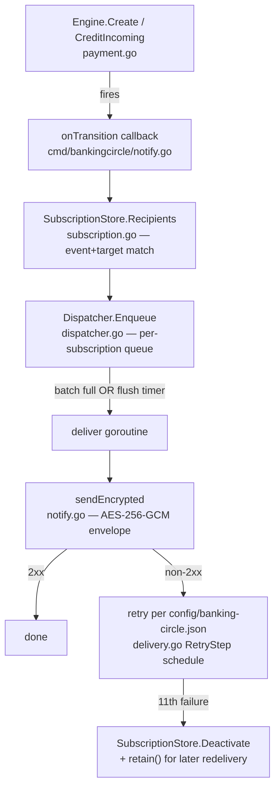
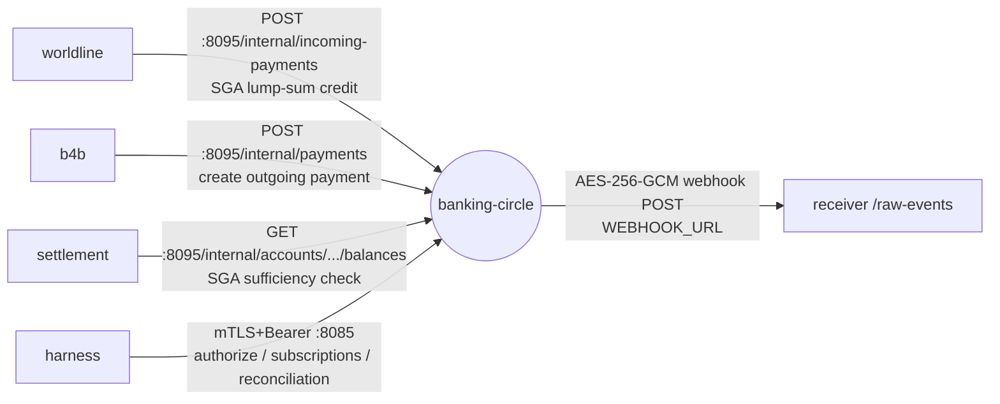

# banking-circle — file by file

Settlement bank: mTLS+bearer API, a safeguarding-account ledger, and
batched AES-256-GCM webhook notifications with the documented eleven-step
retry schedule. See [structure overview](README.md) for the general
cmd/+internal pattern this follows.

## Packaging

`docker/Dockerfile.banking-circle` builds `./cmd/bankingcircle` only.
`compose.yml`'s `banking-circle:` service exposes two ports from one
binary:

- `:8085` — `LISTEN`, the real-shaped surface: mTLS (`BC_MTLS=require` by
  default) + bearer auth
- `:8095` — `INTERNAL_LISTEN`, plain HTTP, no auth — lab-only,
  same-network trust, reached only by `b4b`/`worldline`/`settlement`

`BC_DELIVERY_CONFIG=/config/banking-circle.json` supplies the retry
schedule (11 steps, real delays; `time_scale` compresses them for the lab);
`BC_NOTIFICATION_KEY` is the raw-UTF-8-bytes AES-256 key.

## `cmd/bankingcircle/` — the binary (`package main`)

| File | Responsibility |
| --- | --- |
| `main.go` | env/flags; builds the mTLS listener (`tlsListener`, modes `require`/`optional`/`off`); wires `Ledger`+`Engine`+`SubscriptionStore`+`Dispatcher` into one `*app`; seeds a default subscription; follows the runner's clock (`RUNNER_CLOCK_URL`); starts both listeners (the internal one on its own goroutine). Also the report handlers (intraday reconciliation, rejection; parameter validation and the 400 body), the payment-status read, and the lab hooks: `/internal/payments/{id}/return\|reverse` (mirrored at `/sim/payments/…` for the console) and `/internal/payments/outcomes` |
| `subscriptions.go` | REST handlers for the subscription self-service API — create/list/get/update/activate/deactivate/delete, events + targets, `If-Match` concurrency |
| `notify.go` | `onTransition` (routes a `Payment` into subscription-matched `Notification`s), `paymentDetail` (the two payload shapes of the vendor's examples: booked vs status events), `sendEncrypted` + `encryptNotification` (the real AES-256-GCM envelope), `clientTest` handler |
| `activity.go` | summaries for the `/sim/activity` logs the console reads |

`tokenStore` (bearer-token issuance) is defined in `main.go`, not in
`internal/bankingcircle` — auth/routing glue stays in `cmd`, domain logic
goes in `internal`.

## `internal/bankingcircle/` — the logic (`package bankingcircle`, no `net/http` import)

| File | Responsibility |
| --- | --- |
| `ledger.go` | `Account`/`Ledger` — in-memory balances, one safeguarding account (SGA) per currency seeded at **zero**, auto-vivified creditor accounts, `Move`/`Credit` |
| `payment.go` | `Engine` — outgoing (`Create`) and incoming (`CreditIncoming`) payment lifecycle, reversal (`Reverse`) and return (`Return`, a new incoming payment), forced outcomes (`ForceNext`), the bank's own reference numbers; fires notifications through an injected callback |
| `subscription.go` | `SubscriptionStore` — subscription CRUD, `rowVersion`/`If-Match` optimistic concurrency, event/target matching |
| `dispatcher.go` | `Dispatcher` — one queue per subscription, batches, drives retries via an injected `Send` func |
| `delivery.go` | `DeliveryConfig` (loaded from `config/banking-circle.json`), the retry-schedule math, `Notification`/`Envelope` wire types, `MailBox` |
| `reconciliation.go` | `Reconcile()` — one pure filter function |
| `reports.go` | the intraday reconciliation report (booking rows, reversal rows, paging, account IBANs) and the rejection report |
| `properties.go` | `PropertiesIncluded`/`PropertiesExcluded` selection for the reconciliation report |
| `status.go` | `PaymentStatus` — a payment's state in the vendor's `PaymentStatus` vocabulary |
| `businessdate.go` | `BusinessDate` — the bank's business day (CET, 19:00 cutoff, weekends to Monday) |
| `accountid.go` | account-id validation and the safeguarding account ids |

Every file above has a `_test.go` sibling exercised by `make test`
(`go test ./...`, no Docker). `internal/harness/scenario_bankingcircle.go`
and `scenario_bcsubscription.go` are the other kind of test: a black-box
binary dialing the real container over `:8085`/`:8095` (`make harness`),
importing `internal/bankingcircle` only for two constants and the
`Envelope` struct — everything else is real HTTP, mTLS, and AES-256-GCM
decryption of captured wire bytes.

## How the pieces connect

## Who calls it, who it calls

## One trace, end to end

`b4b` POSTs `/internal/payments` on `:8095` once its own payout reaches
`B4BTMApproved` → `createInternalPayment` (`main.go`) resolves the SGA
debit account by currency, auto-vivifies the merchant's creditor account
via `ledger.GetOrCreate` → `engine.Create` fires `OutgoingPaymentBooked`
immediately and schedules the ledger `Move` after `PROCESSING_DELAY` in a
goroutine → every notification reaches `onTransition` → `subs.Recipients`
finds every subscription whose event+target matches → `dispatch.Enqueue`
per match → batched, then flushed → `sendEncrypted` builds the
AES-256-GCM envelope and POSTs it to `receiver:8443/raw-events` → a
non-2xx replays the schedule in `config/banking-circle.json` (scaled by
`BC_TIME_SCALE`), ending in `Deactivate` + retained notifications for
redelivery on reactivation.

## Further reading

`docs/ARCHITECTURE-banking-circle-webhooks.md` (subscriptions, batching,
the retry schedule), `docs/ARCHITECTURE-vendor-corrections.md` §3 and
`docs/ARCHITECTURE-phase3-corrections.md` §1 (the safeguarding-account
model this supersedes `docs/ARCHITECTURE-banking-circle.md` with).
