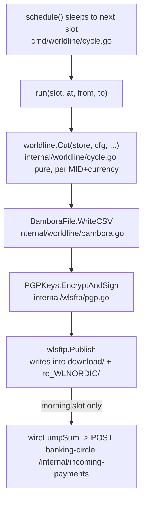
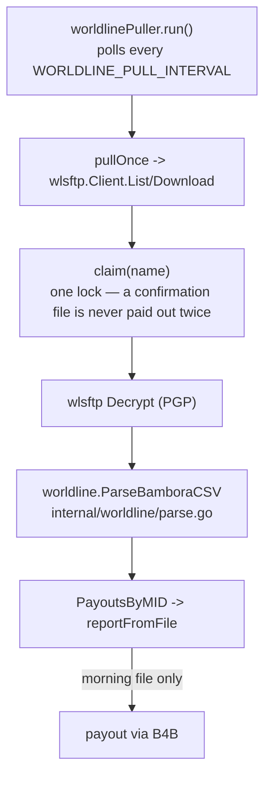
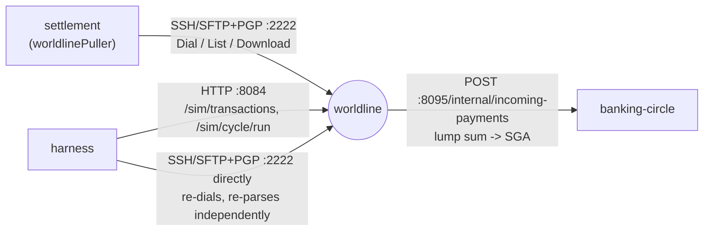

# worldline — file by file

The acquirer: card transactions acquired per submerchant (MID), cut into
the real Bambora settlement-file format twice a day, delivered
PGP-encrypted over a real SSH/SFTP server, plus the matching lump sum
wired to the safeguarding account. Unlike banking-circle and b4b,
**"worldline" is not one binary** — its protocol has a producer half and a
consumer half, and they live in two different `cmd/` binaries. See
[structure overview](README.md) for the general pattern; this is the case
where it stretches furthest.

## Packaging

`docker/Dockerfile.worldline` builds `./cmd/worldline` only. `compose.yml`'s
`worldline:` service exposes two ports:

- `:8084` — `LISTEN`, the HTTP SFT file-exchange channel (onboarding,
  corrections, WX/financial reports)
- `:2222` — the real SSH/SFTP+PGP server

`WORLDLINE_FILE_SOURCE=generate|fixture` switches between synthesizing the
file from `/sim`-seeded transactions and serving a real example file
byte-for-byte from `./worldline/fixtures`. `WORLDLINE_MORNING_FILE_AT`/
`_WINDOW` and `WORLDLINE_AFTERNOON_FILE_AT` schedule the two daily slots;
`BC_INTERNAL_URL` is where the morning slot's lump sum lands.

The *consumer* side has no `Dockerfile.worldline`-adjacent home — it's
compiled into `cmd/settlement`'s binary (own `Dockerfile.settlement`),
configured by `settlement:`'s own `WORLDLINE_SFTP_HOST=worldline` +
`WORLDLINE_PGP_PRIVATE_KEY_PATH` env vars.

## `cmd/worldline/` — the acquirer server (`package main`)

| File | Responsibility |
| --- | --- |
| `main.go` | env/flags; `startWorldlineSFTP` brings up the real SSH/SFTP+PGP server, the transaction store, and the daily cycle in background goroutines; HTTP handlers for the `:8084` SFT gateway (`uploadInbound`, `listInbound`, `listOutboundCategory`, `readOutboundFile`, `getConfig`/`putConfig`, `listArchive`), wrapping `internal/sftpgateway.Channel` |
| `cycle.go` | `settlementApp` (transactions + cycle history + lump-sum wiring), `run()` (cut + publish + lump-sum for one slot), `wireLumpSum()` (credits banking-circle's SGA over `BC_INTERNAL_URL`), `schedule()` (sleeps to the next jittered slot), and the lab-only `/sim/*` control endpoints (`addTransactions`, `runCycle`, `listRuns`) |

## `cmd/settlement/worldline_pull.go` — the consumer half, inside the `settlement` binary

One file, not a directory: `worldlinePuller` polls the acquirer's SFTP
server on a timer (`pullOnce`), `claim`s each filename under one lock
before downloading it (so a slow download can't let a second poll pay the
same file out twice), decrypts and parses it, and turns each MID's total
into a settlement report + B4B payout (`process`, `reportFromFile`). This
is the code path a real-host swap actually exercises — point
`WORLDLINE_SFTP_HOST` at real Worldline and the same code runs. It lives
here, not under `cmd/worldline/`, because `settlement` is the consumer in
this lab's topology (`docs/catalogue.md` calls it the platform stand-in);
the vendor produces files, it doesn't also contain the logic for
downloading its own output.

## `internal/worldline/` — the file format + acquired-transaction ledger

| File | Used by | Responsibility |
| --- | --- | --- |
| `transaction.go` | `cmd/worldline` only | `Transaction` (one acquired card txn), `Store` — the acquirer's own record (`Range`, `MIDsInRange`, `CurrenciesInRange`) |
| `bambora.go` | `cmd/worldline` only | `GenerateBambora`/`GenerateSettlementFile` + `WriteCSV` — the real multi-section Bambora CSV (`ST`/`BT`/`TXER`/`CB` sections), `BamboraFilename` |
| `parse.go` | `cmd/settlement` only | `ParseBamboraCSV`, `PayoutsByMID`, `FilenameSlot` — the reader half of the same format, round-trip-tested against `bambora.go` so generator and parser can't drift apart |
| `cycle.go` | `cmd/worldline` only | `CycleConfig`, `Cut()` (pure — builds `[]CutFile` per MID+currency, no I/O), `NextFire`/`CoverageFor`, slot-name mapping |

## `internal/wlsftp/` — the real SFTP+PGP transport

| File | Used by | Responsibility |
| --- | --- | --- |
| `server.go` | `cmd/worldline` only | `ListenAndServe`/`Serve` — real SSH server + `github.com/pkg/sftp` subsystem, key+password auth |
| `client.go` | `cmd/settlement` only | `Dial`/`List`/`Download` — real SSH/SFTP client, host-key pinning |
| `pgp.go` | both | `GenerateEntity`/`LoadOrGenerateKeypair`/`Encrypt`/`Decrypt`/`EncryptAndSign` — real OpenPGP; worldline encrypts+signs, settlement decrypts+verifies |
| `publish.go` | `cmd/worldline` only | `Publish()` — writes a file PGP-encrypted into both real path conventions under the server's own root |
| `hostkey.go` | `cmd/worldline` only | `LoadOrGenerateHostKey` — the SSH host identity |

## `internal/sftpgateway/` — the separate HTTP-simulated SFT channel

| File | Used by | Responsibility |
| --- | --- | --- |
| `channel.go` | `cmd/worldline` only | `Channel` — onboarding/corrections inbound drop, daily/financial outbound listing+read+archive, `Config` persistence. This is the `:8084` surface, a *different* channel from the real `:2222` SFTP+PGP one — `settlement` never touches it |

## How the pieces connect

Producer side:

Consumer side:

## Who calls it, who it calls

## One trace, end to end

Transactions get seeded via `/sim/transactions` (or accrue however a
fuller scenario models acquiring) → `schedule()` fires the morning slot →
`Cut` groups them by MID and currency → `GenerateSettlementFile`/`WriteCSV`
renders the real multi-section CSV → `EncryptAndSign` PGP-encrypts and
signs it → `Publish` writes it under both real path conventions in the
SFTP root → `wireLumpSum` credits banking-circle's SGA for the settlement
total. Independently, `settlement`'s `worldlinePuller` is polling the same
SFTP root on its own timer → downloads whatever's new, `claim`s the
filename before touching it, decrypts, `ParseBamboraCSV` + `PayoutsByMID`
recover each MID's total → paid out per MID through B4B. Hours later the
*afternoon* slot publishes the same content again as a confirmation (`AR`
instead of `ER`) — the puller downloads and archives it too, but only a
morning (`ER`) file reaches `process`, so the confirmation is never paid
out a second time.

## Further reading

`docs/ARCHITECTURE-worldline-acquirer.md` (who owns the file, the two
slots, one file per currency), `docs/ARCHITECTURE-worldline-sftp-channel.md`
(the `:8084` onboarding/reports channel), `docs/ARCHITECTURE-vendor-corrections.md`
§1–2 and its Addendum §E (the real Bambora format and the real SFTP+PGP
transport, including the self-encryption fallback).
